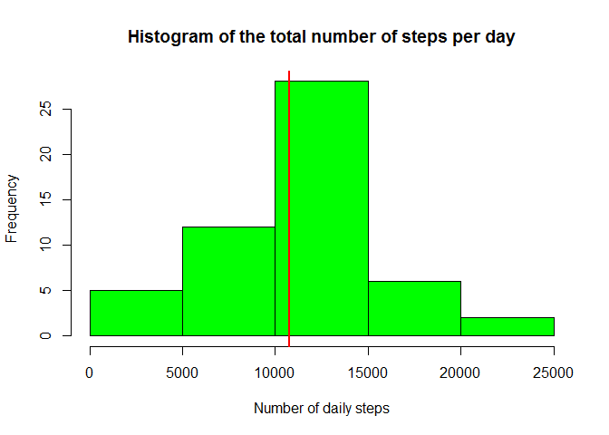
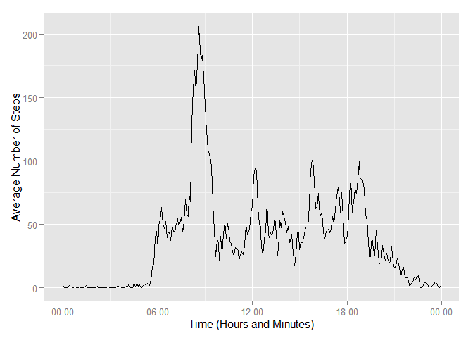
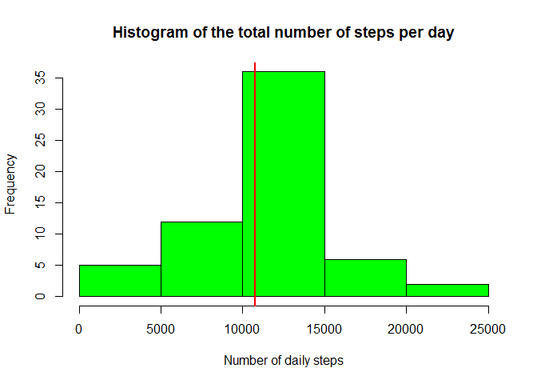
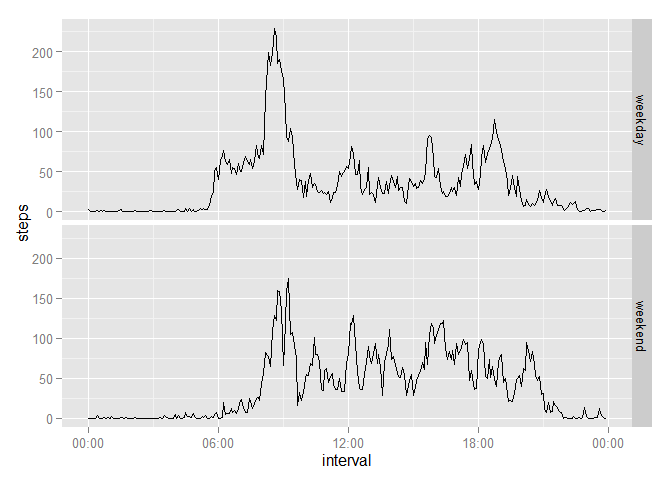

# Reproducible Research: Peer Assessment 1

## Loading and preprocessing the data

Since the zip file that we are going to use in this analysis is already in the
repository, the first step is to unzip the csv file and load it into a data 
frame.  

```r
unzip("activity.zip")
df_activity<-read.csv("activity.csv")
```


## What is mean total number of steps taken per day?

I chose to remove the NA values from this analysis. So, the first step here is 
to remove NA Values.  

I use **sqldf** package to manipulate the dataset. The goal is to aggregate the 
total steps by day.


```r
library(sqldf)

df_activity_complete<- df_activity[complete.cases(df_activity[,1]), ]
report_data<-sqldf("select date, sum(steps) as total_steps from 
                   df_activity_complete group by date")
```

We can now create the requested histogram. 
I will also plot an additional line with the **mean** value.  


```r
hist(report_data$total_steps, col='green', 
     main = 'Histogram of the total number of steps per day', 
     xlab = 'Number of daily steps')
abline(v=mean(report_data$total_steps), col = 'red', lwd = 2)
```

 

```r
mean_value <- mean(report_data$total_steps)
median_value <-prettyNum(median(report_data$total_steps))
```

The **median** value is **10765**.  
The **mean** value is **10766.19**.  
Since the values are so close, this is why I only plotted the line with the 
**mean** value.


## What is the average daily activity pattern?

To achieve the plot with the 5-minute interval, averaged across all days, we 
will select the average number of steps by interval. This way, we will have the 
average of steps in each interval.

The second step is to convert the intervals column into time in order to 
be able to plot the data with the proper axis values.


```r
report_data<-sqldf("select interval, avg(steps) as avg_steps 
                   from df_activity_complete group by interval")
report_data$interval<-as.POSIXct(formatC(report_data$interval, width=4, 
                                         flag="0"), 
                                 format = '%H%M')
```

I will **ggplot2** package to plot the data and **scales** in order to format 
the x axis.


```r
library(ggplot2)
library(scales)

qplot(report_data$interval, report_data$avg_steps, 
      geom='line', 
      xlab='Time (Hours and Minutes)', ylab='Average Number of Steps') +
    scale_x_datetime(labels = date_format("%H:%M"))
```

 

```r
time_interval<-format(report_data[report_data$avg_steps==
                                      max(report_data$avg_steps), 1],
                      "%H:%M")
```

The 5 minute interval that has more steps across all days starts at 
**08:35.**  


## Imputing missing values

First step is to build a dataframe with the missing values and then, count the rows of the resulting dataframe

```r
df_na_activity<-df_activity[is.na(df_activity$steps)==TRUE, ]
nr_missing_cases <- nrow(df_na_activity)
nr_missing_cases
```

```
## [1] 2304
```

The number of missing cases is **2304**

The strategy to input the missing values is to calculate the mean for the intervals across all days and assign it to the missing intervals.


```r
#Calculates the mean for each interval
df_mean_activity<-sqldf("select interval, avg(steps) as avg_steps from df_activity_complete group by interval")

#merges df_mean_activity and df_na_activity data frames
df_filled_activity<-merge(df_mean_activity,df_na_activity, by = 'interval')

#preparing the df_filled_activity to bind it with the one that has the complete cases and achieve the full dataset
df_filled_activity<-df_filled_activity[, c("avg_steps","date","interval")]
colnames(df_filled_activity) = c("steps","date","interval")

#data frames binding
df_new_activity<-rbind(df_activity_complete, df_filled_activity)
```

Now, it is necessary to recalculate the report data to extend it to the full dataset and plot the results. As in the first chart, I will add an additional line with the **mean**


```r
report_data<-sqldf("select date, sum(steps) as total_steps from df_new_activity group by date")

#Plots
hist(report_data$total_steps, col='green')
abline(v=median(report_data$total_steps), col='red', lwd=5)
```

 

```r
#values to report
median_value<-median(report_data$total_steps)
mean_value<-mean(report_data$total_steps)
```

The **median** value is **10766.19**.  
The **mean** value is **10766.19**.  

The median became the mean value. This means that the previous median had less occurrences that the number of missing days and hence, the change.

As per the histogram, there was no significant change.


## Are there differences in activity patterns between weekdays and weekends?


```r
library(ggplot2)
library(lubridate)

df_new_activity$weekday<-"weekday"
df_new_activity$weekday[weekdays(ymd(df_new_activity$date))=="Saturday"]<- "weekend"
df_new_activity$weekday[weekdays(ymd(df_new_activity$date))=="Sunday"]<- "weekend"


report_data<-sqldf("select weekday, interval, avg(steps) steps from df_new_activity group by weekday, interval")


qplot(data=report_data, interval, steps, facets = weekday~., geom="line")
```

 

There are no morning walks on weekends.
